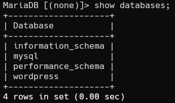
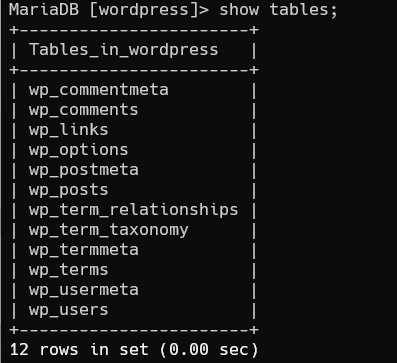
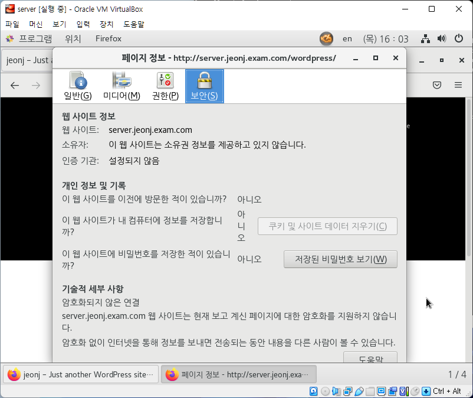
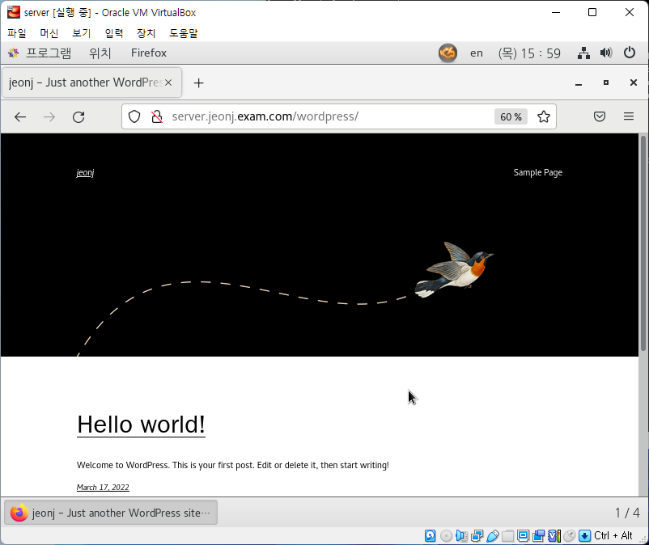
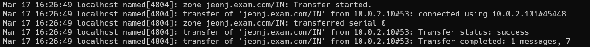
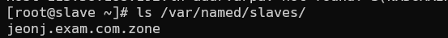

# 리눅스 미니 프로젝트 - Wordpress 게시판
 
**목차**

1. 프로젝트 개요
 
	1. 프로젝트 목적 및 요구사항
	2. 프로젝트 기간
	3. 프로젝트 환경
    
2. 프로젝트 과정
	1. DB 서버 구축
	2. 웹 서버 구축
	3. DNS 서버 구축
	4. DNS 서버 Master/Slave 구조 구축
	5. https 설정

3. 프로젝트 결과

## 1. 프로젝트 개요

### 1. 1 프로젝트 목적 및 요구사항

분리된 WEB, DB, DNS(Master, Slave) 서버를 통해 Wordpress 게시판 구현 https 프로토콜로 암호화하여 보안성 강화

```
We recommend servers running version 7.4 or greater of PHP and ySQL version 5.7 OR MariaDB version 10.2 or greater.

We also recommend either Apache or Nginx as the most robust options or running WordPress, but neither is required.
```

### 1. 2 프로젝트 기간

2022.03.14 ~ 2022.03.18


### 1. 3 프로젝트 환경

윈도우상의 VirtualBox로 진행


| OS | CentOS Linux 7 |
| --- | --- |
| Server | httpd-2.4.6-97, php-7.4 |
| DB | MariaDB-server-10.2.43-1 |
| DNS | bind-9.11.4 |
| https | mod_ssl-2.4.6-97 |

## 2. 프로젝트 과정

기본값: SELinux 설정 off

- SELinux는 Linux의 보안을 강화해 주는 보안 강화 커널이다.
특정 서비스가 SELinux 때문에 동작하지 않는다면 SELinux를 끄기보다는 해당 서비스가 SELinux 하에서 잘 동작하도록 설정을 수정하는걸 권장한다.

```
[root@server ~]# setenforce 0
[root@server ~]# getenforce 0
Permissive
```

## 2. 1 DB 서버 구축

 기존 MariaDB 삭제 및 MariaDB 10.2이상 설치
 
 - RHEL 7 또는 CentOS 7에 MariaDB Community Server 10.4를 배포하려면 먼저 `mariadb_repo_setup`스크립트를 사용하여 yum용 MariaDB 레포지토리를 구성한다.
 
 ```
 [root@db ~]# yum remove mariadb
 [root@db ~]# yum -y install MariaDB-server MariaDB-client
 Complete!
 ```
 
 ```
 [root@db ~]# vim /etc/yum.repos.d/MariaDB.repo
   [mariadb]
   name = MariaDB
   baseurl = https://mirror.yongbok.net/mariadb/yum/10.2/centos7-amd64
   gpgkey=https://mirror.yongbok.net/mariadb/yum/RPM-GPG-KEY-MariaDB
   gpgcheck=1
 ```
 
 ### MariaDB 포트 허용 및 방화벽 설정
 
 - MariaDB를 설치하면 기본적으로 외부 접속이 불가능하게 되어 있다. 관리툴을 사용하려면 원격 접속을 가능하도록 해야 한다.
 먼저 콘솔로 들어가서 아래 쿼리를 순서대로 입력하여 외부 접속이 가능하도록 로트 계정의 사용하여 호스트 값을 추가해 준다.
 
 ```
 [root@db ~]# systemctl start mariadb.service
 [root@db ~]# systemctl enable mariadb.service
 [root@db ~]# /usr/bin/mysql_secure_installation
 
 Enter current password for root (enter for none):
 OK, successfully used password, moving on...
 
 Set root password? [Y/n] y
 New password:
 Re-enter new password:
 Remove anonymous users? [Y/n] y
 Disallow root login remotely? [Y/n] n
 Remove test database and access to it? [Y/n] y
 Reload privilege tables now? [Y/n] y
 ```
 
 - MariaDB의 준비는 완료되었지만, OS에서는 방화벽 설정이 남아있다.
 MariaDB의 포트를 여는 설정을 진행한다.
 
 ```
 [root@db ~]# firewall-cmd --permanent --zone=public --add-port=3306/tcp
 success
 [root@db ~]# firewall-cmd --reload
 success
 [root@db ~]# firewall-cmd --list-all
 public (active)
  target: default
  icmp-block-inversion: no
  interfaces: enp0s3 enp0s8
  sources:
  services: dhcpv6-client ssh
  ports: 3306/tcp
  protocols:
  masquerade: no
  forward-ports:
  source-ports:
  icmp-blocks:
  rich rules:
 ```
 
 ### Wordpress 사용할 데이터베이스 설정
 
 - ‘%’를 부여하면 [localhost](http://localhost) 및 외부 모든곳에서 접속할 수 있는 권한을 부여하는 것이다.
 
 ```
 [root@db ~]# mysql -u root -p 1
 
 MariaDB [(none)]> CREATE DATABASE wordpress;
 MariaDB [(none)]> CREATE USER adminuser@'%' IDENTIFIED BY 'dkagh1.';
 MariaDB [(none)]> GRANT ALL PRIVILEGES ON wordpress.* TO adminuser@'%' IDENTIFIED BY 'dkagh1.';
 MariaDB [(none)]> FLUSH PRIVILEGES;
 MariaDB [(none)]> exit
 ```
 

## 2. 2 웹 서버 구축

 웹 서버 설치
 
 - httpd는 아파치 하이퍼텍스트 전송 프로토콜 서버 프로그램이다.
 
 ```
 [root@server ~]# yum -y install httpd
 ```
 
 ### 방화벽 정책 추가
 
 ```
 [root@server ~]# firewall-cmd --add-service=http
 success
 [root@server ~]# firewall-cmd --add-service=http --permanent
 success
 [root@server ~]# firewall-cmd --list-all
 public (active)
  target: default
  icmp-block-inversion: no
  interfaces: enp0s3 enp0s8
  sources:
  services: dhcpv6-client http ssh
  ports:
  protocols:
  masquerade: no
  forward-ports:
  source-ports:
  icmp-blocks:
  rich rules:
 ```
 
 ### php7.4 이상 설치 및 기존 php5.4 종료
 
 - *We recommend servers running version 7.4 or greater of PHP*
 
 ```
 [root@server ~]# yum -y install https://rpms.remirepo.net/enterprise/remi-release-7.rpm
 Complete!
 [root@server ~]# yum-config-manager --disable remi-php54
 [root@server ~]# yum-config-manager --enable remi-php74
 [root@server ~]# yum -y install php74-php php-cli php74-scldevel php php-mysql
 Complete!
 ```
 
 ### Wordpress 게시판 다운로드
 
 - wget은 Web Get의 약어로, 웹 상의 파일을 다운로드 받을 때 사용하는 명령어이다.
 파일을 다운로드 후 해당되는 압축해제 후 해당 폴더로 옮긴다.
 
 ```
 [root@server ~]# yum -y install wget
 [root@server ~]# wget https://wordpress.org/latest.tar.gz
 [root@server ~]# file latest.tar.gz
 [root@server ~]# tar -xvzf latest.tar.gz -C /var/www/html
 [root@server ~]# mkdir /var/www/html/wordpress/uploads
 ```
 
 ### Wordpress 구성
 
 - 샘플파일인 *wp-config-sample.php* 를 복사하여 사용한다.
 파일 내용중에는 아래와 같은 DB 정보가 설정된 곳이 보인다. 이 정보들의 값을 자신이 준비한 DB 내용으로 변경한다.
 
 ```
 [root@server ~]# cd /var/www/html/wordpress
 [root@server wordpress]# cp wp-config-sample.php wp-config.php
 [root@server wordpress]# chown -R apache:apache /var/www/html/wordpress
 [root@server wordpress]# vim  wp-config.php
   define( 'DB_NAME', 'wordpress' );
   /** Database username */
   define( 'DB_USER', 'adminuser' );
   /** Database password */
   define( 'DB_PASSWORD', '1' );
   /** Database hostname */
   define( 'DB_HOST', '192.168.56.118' );
 ```
 

## 2. 3 DNS 서버 구축

 DNS 서버 구성
 
 - bind의 주요 기능은 해당 IP주소로 변환하는 것이다.
 
 ```
 [root@master ~]# yum -y install bind bind-utils
 [root@master ~]# nmcli con add con-name static ifname enp0s3 type ethernet ip4 10.0.2.10/24 gw4 10.0.2.1 ipv4.dns 10.0.2.10
 연결 'static' (d7cb0ec5-d0c9-42aa-92e2-380b89d4dd3f)이 성공적으로 추가되었습니다.
 [root@master ~]# nmcli con reload
 [root@master ~]# nmcli con up static
 연결이 성공적으로 활성화되었습니다 (D-Bus 활성 경로: /org/freedesktop/NetworkManager/ActiveConnection/5)
 ```
 
 ### 정방향 조회 구성
 
 - 정방향 조회는 호스트 이름과 IP 주소간의 매핑이 포함된다. 컴퓨터가 호스트 이름을 제공하여 IP 주소를 요청하면 지정된 호스트 이름에 대한 IP 주소를 찾기 위해 정방향 조회 영역이 쿼리된다.
 
 ```
 [root@master ~]# vim /etc/named.conf
   options {
        listen-on port 53 { any; };
        listen-on-v6 port 53 { none; };
               ...
        allow-query     { any; };
   ...
   zone "jeonj.exam.com" IN {
        type master;
        file "jeonj.exam.com.zone";
   };
 [root@master ~]# cd /var/named
 [root@master named]# cp named.empty jeonj.exam.com.zone
 [root@master named]# vim jeonj.exam.com.zone
   $TTL 3H
   @       IN SOA  jeonj.exam.com. root.jeonj.exam.com. (
                                        0       ; serial
                                        1D      ; refresh
                                        1H      ; retry
                                        1W      ; expire
                                        3H )    ; minimum
           NS      dns.jeonj.exam.com.
           A       10.0.2.2
   dns     A       10.0.2.10
   db      A       192.168.56.118
   server  A       10.0.2.2
 
 [root@master named]# chmod 660 jeonj.exam.com.zone
 [root@master named]# chown :named jeonj.exam.com.zone
 ```
 
 ### 정방향 조회 구성 확인
 
 ```
 [root@master named]# systemctl enable named --now
 Created symlink from /etc/systemd/system/multi-user.target.wants/named.service to /usr/lib/systemd/system/named.service.
 [root@master named]# firewall-cmd --add-service=dns --permanent
 success
 [root@master named]# firewall-cmd --reload
 
 [root@master named]# host db.jeonj.exam.com
 db.jeonj.exam.com has address 192.168.56.118
 ```
 
 ### 역방향 조회 구성
 
 - 역방향 조회는 IP주소를 통해 목적이를 찾아가면 www, mail 등등의 여러곳이 존재하는 문제점을 가지고 있다. 또한 보안상의 문제로 잘 사용되지 않지만 클라우드 환경에서는 가상 머신의 생성, 소멸이 빈번하므로 이를 검색하기 위해 역방향 조회가 사용된다.
 
 ```
 [root@master named]# vim /etc/named.conf
   zone "56.168.192.in-addr.arpa" IN {
           type master;
           file "192.168.56.0.zone";
   };
   ...
   /*
   zone "2.0.10.in-addr.arpa" IN {
           type master;
           file "10.0.2.0.zone;
   };
   */
 [root@master named]# vim /etc/named.conf
 [root@master named]# cp jeonj.exam.com.zone 192.168.56.0.zone
 [root@master named]# vim 192.168.56.0.zone
   $TTL 3H
   @       IN SOA  jeonj.exam.com. root.jeonj.exam.com. (
                                           0       ; serial
                                           1D      ; refresh
                                           1H      ; retry
                                           1W      ; expire
                                           3H )    ; minimum
           NS      dns.jeonj.exam.com.
           A       192.168.56.2
   118     PTR     db.jeonj.exam.com.
   117     PTR     server.jeonj.exam.com.
 
 [root@master named]# chmod 660 192.168.56.0.zone
 [root@master named]# chown :named 192.168.56.0.zone
 ```
 
 ### 역방향 조회 구성 확인
 
 ```
 [root@master named]# systemctl restart named
 [root@master named]# systemctl enable named
 [root@master named]# host 192.168.56.118
 118.56.168.192.in-addr.arpa domain name pointer db.jeonj.exam.com.
 ```
 

## 2. 4 DNS 서버 Master/Slave 구조 구축

Master와 Slave는 주-보조 관계이며 DNS 서버를 이중화 시킨다.

Master/Slave는 동기화 과정으로 통해 zone 파일을 관리하게 되는데, zone 파일의 SOA 필드에 있는 serial을 확인하여 이 파일이 업데이트가 되었는지 판단한다. serial이 증가했을 경우 업데이트 된 것으로 판단하고 동기화 과정을 통해 Slave 서버로 zone 파일이 전송된다.

만약, Master 서버에 장애가 발생할 경우 Slave 서버에서 서비르를 중단없이 지속적으로 제공한다.

 **Master 구성**
 
 
 ```
 [root@master named]# vim /etc/named.conf
   zone "jeonj.exam.com" IN {
           type master;
           file "jeonj.exam.com.zone";
           allow-transfer { 10.0.2.101; };
   };
 
   zone "56.168.192.in-addr.arpa" IN {
           type master;
           file "192.168.56.0.zone";
           allow-transfer {10.0.2.101; };
   };
 
 [root@master named]# vim /var/named/jeonj.exam.com.zone
   $TTL 3H
   @       IN SOA  jeonj.exam.com. root.jeonj.exam.com. (
                                           0       ; serial
                                           1D      ; refresh
                                           1H      ; retry
                                           1W      ; expire
                                           3H )    ; minimum
           NS      dns.jeonj.exam.com.
           NS      slave.jeonj.exam.com.
           A       10.0.2.2
   dns     A       10.0.2.10
   db      A       192.168.56.118
   server  A       192.168.56.117
   slave   A       10.0.2.101
 
 [root@master named]# vim 192.168.56.0.zone
   $TTL 3H
   @       IN SOA  jeonj.exam.com. root.jeonj.exam.com. (
                                           0       ; serial
                                           1D      ; refresh
                                           1H      ; retry
                                           1W      ; expire
                                           3H )    ; minimum
           NS      dns.jeonj.exam.com.
           NS      slave.jeonj.exam.com.
           A       192.168.56.2
   118     PTR     db.jeonj.exam.com.
   117     PTR     server.jeonj.exam.com.
 ```
 
 ### Slave 구성
 
 ```
 [root@slave ~]# yum -y install bind bind-utils
 Complete!
 [root@slave ~]# nmcli con add con-name static ifname enp0s3 type ethernet ip4 10.0.2.101/24 ipv4.dns 10.0.2.10
 연결 'static' (730f987d-717a-40ff-9f3f-c579562fdd3c)이 성공적으로 추가되었습니다.
 [root@slave ~]# nmcli con reload
 [root@slave ~]# nmcli con up static
 연결이 성공적으로 활성화되었습니다 (D-Bus 활성 경로: /org/freedesktop/NetworkManager/ActiveConnection/5)
 [root@slave ~]# vim /etc/named.conf
   options {
           listen-on port 53 { any; };
           listen-on-v6 port 53 { none; };
   ...
           allow-query     { any; };
   ...
 
   zone "jeonj.exam.com" IN {
           type slave;
           masters { 10.0.2.10; };
           file "slaves/jeonj.exam.com.zone";
           notify no;
   };
 
   zone "2.0.10.in-addr.arpa" IN {
           type slave;
           masters { 10.0.2.10; };
           file "slaves/10.0.2.0.zone";
           notify no;
   };
 ```
 
 ### Master/Slave 구성 조회
 
 ```
 [root@slave ~]# systemctl enable named --now
 [root@slave ~]# firewall-cmd --add-service=dns --permanent
   success
 [root@slave ~]# firewall-cmd --reload
   success
 
 [root@slave ~]# ls /var/named/slaves/
   jeonj.exam.com.zone
 ```
 
 ### 혹은
 
 ```
 [root@slave ~]# more /var/log/messages
 ...
 Mar 17 16:26:49 localhost named[4804]: transfer of 'jeonj.exam.com/IN' from 10.0.2.10#53: connected using 10.0.2.101#45448
 Mar 17 16:26:49 localhost named[4804]: zone jeonj.exam.com/IN: transferred serial 0
 Mar 17 16:26:49 localhost named[4804]: transfer of 'jeonj.exam.com/IN' from 10.0.2.10#53: Transfer status: success
 Mar 17 16:26:49 localhost named[4804]: transfer of 'jeonj.exam.com/IN' from 10.0.2.10#53: Transfer completed: 1 messages, 7
 records, 201 bytes, 0.004 secs (50250 bytes/sec)
 ...
 ```
 
 ### Client 구성
 
 ```
 [root@server ~]# nmcli con add con-name static ifname enp0s3 type ethernet ip4 10.0.2.20/24 gw4 10.0.2.2 ipv4.dns 10.0.2.10
 연결 'static' (431c562f-b00b-4a2b-8323-aabd959c2dd2)이 성공적으로 추가되었습니다.
 [root@server ~]# nmcli con mod static +ipv4.dns 10.0.2.101
 [root@server ~]# nmcli con reload
 [root@server ~]# nmcli con up static
 연결이 성공적으로 활성화되었습니다 (D-Bus 활성 경로: /org/freedesktop/NetworkManager/ActiveConnection/5)
 ```
 
 ### Client 조회
 
 ```
 [root@server ~]# host dns.jeonj.exam.com
 dns.jeonj.exam.com has address 10.0.2.10
 ```
 

## 2. 5 https 설정

HTTPS는 HTTP protocol의 암호화된 버전이다. 대게 클라이언트와 서버 간의 모든 커뮤니테이션을 암호화하기 위하여 SSL이나 TLS을 사용한다.

이 커넥션은 클라이언트가 민감한 정보를 서버와 안전하게 주고받도록 해준다.

 ssl 패키지 설치
 
 
 ```
 [root@server ~]# yum -y install mod_ssl
 [root@server ~]# openssl genrsa -out private.key 2048
 Generating RSA private key, 2048 bit long modulus
 ..................................................................+++
 .............................................................+++
 e is 65537 (0x10001)
 [root@server ~]# openssl req -new -key private.key -out cert.csr
   Country Name (2 letter code) [XX]:kr
   State or Province Name (full name) []:seoul
   Locality Name (eg, city) [Default City]:city
   Organization Name (eg, company) [Default Company Ltd]:jeonj
   Organizational Unit Name (eg, section) []:computer
   Common Name (eg, your name or your server's hostname) []:jeonj
   Email Address []:jeonj@jeonj
 
 [root@server ~]# openssl x509 -req -signkey private.key -in cert.csr -out cert.crt
   Signature ok
   subject=/C=kr/ST=seoul/L=city/O=jeonj/OU=computer/CN=joenj/emailAddress=jeonj@jeonj
   Getting Private key
 
 [root@server ~]# chmod 600 private.key cert.crt
 
 [root@server ~]# mv private.key /etc/pki/tls/private/
 [root@server ~]# mv cert.* /etc/pki/tls/certs/
 ```
 
 ### .conf 변경
 
 ```
 [root@server ~]# vim /etc/httpd/conf.d/ssl.conf
   ...
   DocumentRoot "/var/www/html"
   ServerName server.jeonj.exam.com:443
   ...
   SSLCertificateFile /etc/pki/tls/certs/cert.crt
   SSLCertificateKeyFile /etc/pki/tls/private/private.key
   ...
 [root@server ~]# vim /etc/httpd/conf/httpd.conf
   <VirtualHost *:80>
       DocumentRoot /var/www/html
       ServerName jeonj.exam.com
       RewriteEngine On
       RewriteCond %{HTTPS} off
       RewriteRule ^(.*)$https://%{HTTP_HOST}%{REQUEST_URI} [R=301,L]
   </VirtualHost>
 
 [root@server ~]# systemctl restart httpd
 
 [root@server ~]# firewall-cmd --add-service=https --permanent
 success
 [root@server ~]# firewall-cmd --reload
 success
 ```
 

# 3. 프로젝트 결과

## DB 데이터베이스 및 테이블 조회

 
 
 
 
 
 
 

## HTTPS 확인

 
 
 
 
 

## DNS 서버 구동

 
 
 
 


## Master/Slave 구동

 
 
 
 
 
 
