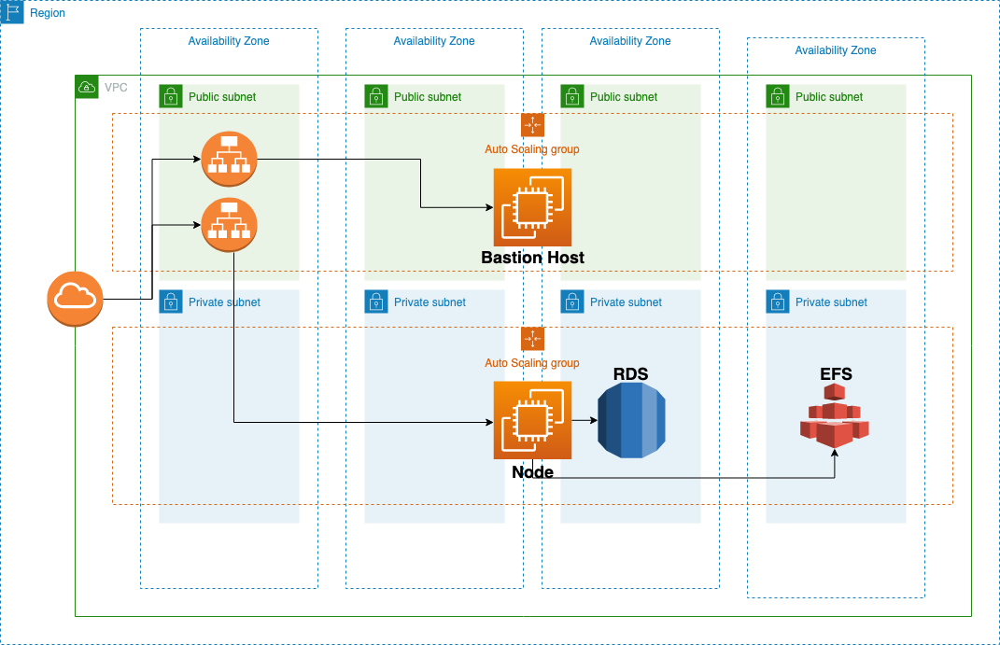
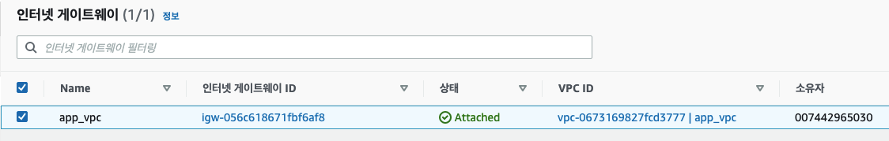
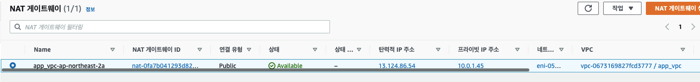
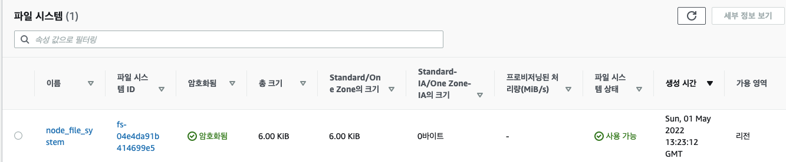
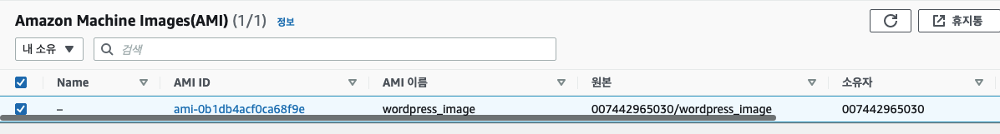
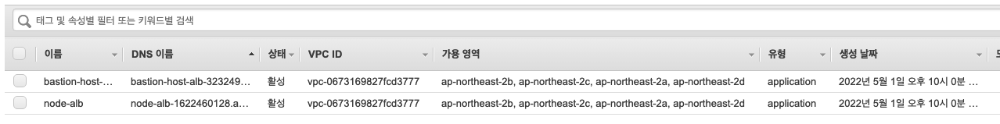

# AWS
## 구성도

## AWS 사용 서비스
- VPC
- Security Group
- RDS
- ASG, Launch Template, ALB, Target Group
- EFS
- EC2
## Terraform 
### 키 페어 생성
```
resource "aws_key_pair" "app_server_key" {  
  key_name   = "app_server_key"  
  public_key = file("/home/vagrant/.ssh/id_rsa.pub")  
}
```

file 함수를 사용하여 id_rsa.pub 파일을 공개키로 등록을 했고 해당 키네임을 app_server_key 로 작성했다.

### VPC 생성
```
# NAT 게이트 용 EIP  
resource "aws_eip" "nat" {  
  count = 1  
  vpc   = true  
}  
  
module "app_vpc" {  
  source = "terraform-aws-modules/vpc/aws"  
  #  version = "~> 3.0"  
  
  name = "app_vpc"  
  cidr = "10.0.0.0/16"  
  
  azs              = ["ap-northeast-2a", "ap-northeast-2b", "ap-northeast-2c", "ap-northeast-2d"]  
  public_subnets   = ["10.0.1.0/24", "10.0.2.0/24", "10.0.3.0/24", "10.0.4.0/24"]  
  private_subnets  = ["10.0.10.0/24", "10.0.11.0/24", "10.0.12.0/24", "10.0.13.0/24"]  
  database_subnets = ["10.0.20.0/24", "10.0.21.0/24", "10.0.22.0/24", "10.0.23.0/24"]  
  
  # 하나의 가용 영역에 한 개의 nat 게이트웨이 설정  
  enable_nat_gateway     = true  
  single_nat_gateway     = true  
  one_nat_gateway_per_az = false  
  reuse_nat_ips          = false  
  external_nat_ip_ids    = aws_eip.nat.*.id  
  
  create_database_subnet_group = true  
}
```
VPC module 을 사용하면 한 개의 블록에서 VPC, subnets, az, nat 등 네트워크 설정들을 한 번에 관리할 수 있다. 

NAT 게이트웨이를 위해 탄력적 IP 를 resource 블록에서 한 개 생성한다.

VPC 모듈에서 가용 영역을 설정하고 public subnet, private subnet, db subnet 의 CIDR 블록을 생성한다.

또한 하나의 가용 영역에 한 개의 NAT 게이트웨이를 추가할 것이기 때문에 nat 게이트웨이에 대한 설정을 해줬다. 

enable_nat_gateway 은 nat 게이트웨이를 사용할 것인지 묻는 것이다.
single_nat_gateway 는 nat 게이트웨이를 하나만 사용할 것인지 묻는 것이다. one_nat_gateway_per_az  는 각 가용 영역 마다 nat 게이트웨이를 하나 씩 부착할 것인지 묻는 것이다. 
reuse_nat_ips 는 nat 게이트웨이에 부착된 ip 를 재사용할 지에 대한 여부이다. external_nat_ip_ids 는 nat 게이트웨이에 부착할 탄력적 ip 주소의 id 를 적으면 된다.
create_database_subnet_group 은 database 용 서브넷을 생성할 것인지에 대한 여부를 묻는 것 이다. 이 VPC 에서 데이터베이스 서브넷을 생성할 것이기 때문에 true 로 설정했다.


실제로 VPC 는 위 사진과 같이 생성된 것을 확인할 수 있다.


서브넷도 코드로 작성한 값들이 제대로 생성된 것을 확인할 수 있다.


라우팅 테이블은 디폴트 값이 설정되어 있어 자동으로 생성된 것을 확인할 수 있다.



인터넷 게이트웨이가 생성된 것을 확인할 수 있고, 한 개의 가용 영역에서 EIP 를 가진채로 NAT 게이트웨이가 생성된 것을 확인할 수 있다.
### Security Group 생성
```
resource "aws_security_group" "bastion_sg" {  
  name   = "bastion_security_group"  
  vpc_id = module.app_vpc.vpc_id  
  
  ingress {  
    from_port   = 22  
    to_port     = 22  
    protocol    = "tcp"  
    cidr_blocks = [file("./my_ip.txt")]  
  }  
  
  egress {  
    from_port   = 0  
    to_port     = 0  
    protocol    = "-1"  
    cidr_blocks = ["0.0.0.0/0"]  
  }  
  
  tags = {  
    Name = "bastion_security_group"  
    to_port     = 0  
    protocol    = "-1"  
    cidr_blocks = ["0.0.0.0/0"]  
  }  
  tags = {  
    Name = "node_security_group"  
  }  
}  
  
resource "aws_security_group" "alb_sg" {  
  name   = "alb_security_group"  
  vpc_id = module.app_vpc.vpc_id  
  
  ingress {  
    from_port   = 80  
    to_port     = 80  
    protocol    = "tcp"  
    cidr_blocks = ["0.0.0.0/0"]  
  }  
  
  egress {  
    from_port   = 0  
    to_port     = 0  
    protocol    = "-1"  
    cidr_blocks = ["0.0.0.0/0"]  
  }  
  
  tags = {  
    Name = "alb_security_group"  
  }  
}  
  
resource "aws_security_group" "node_efs_sg" {  
  name   = "node_efs_security_group"  
  vpc_id = module.app_vpc.vpc_id  
  
  ingress {  
    from_port       = 2049  
    protocol        = "tcp"  
    to_port         = 2049  
    security_groups = [aws_security_group.node_sg.id]  
  }  
  
  egress {  
    from_port       = 0  
    protocol        = "-1"  
    to_port         = 0  
    security_groups = [aws_security_group.node_sg.id]  
  }  
  
  tags = {  
    Name = "node_efs_sg"  
  }  
}
```
aws_security_group 이라는 리소스 블록을 사용하여 보안 그룹을 생성할 수 있다.

각각의 보안 그룹에 이름 태그를 달아두었다.

ingress 는 인바운드 규칙이고 egress 는 아웃바운드 규칙이다.

ingress 에서 살펴볼 것은 security_groups 와 cidr_blocks 이다. 

security_groups 는 보안 그룹을 src 로 설정할 수 있고, cidr_blocks 은 CIDR 블록만 입력할 수 있다.

또한, vpc_id 를 입력하여 해당 보안 그룹을 원하는 VPC 에 설정할 수 있다.


실제로 생성된 보안 그룹은 위와 같다.

### RDS 생성
```
module "rds_allow" {  
  source = "terraform-aws-modules/security-group/aws"  
  
  name            = "rds_allow_sg"  
  description     = "rds"  
  vpc_id          = module.app_vpc.vpc_id  
  use_name_prefix = false  
  
  ingress_with_source_security_group_id = [  
    {      
	  rule                     = "mysql-tcp"  
      source_security_group_id = aws_security_group.node_sg.id  
    }  
  ]  
  
  egress_with_cidr_blocks = [  
    {      from_port   = 0  
      to_port     = 0  
      protocol    = "-1"  
      description = "all"  
      cidr_blocks = "0.0.0.0/0"  
    }  
  ]
}  
  
# 템플릿(프리티어), 디비 인스턴스 이름  
# 디비 마스터 사용자 이름, 비밀번호  
# 스토리지  
# 가용성 및 내구성(다중 AZ)  
# vpc 세팅 및 서브넷 설정, 퍼블릭 액세스 설정, VPC 보안 그룹 세팅  
# 데이터 베이스 인증 옵션(암호인증)  
# 초기 데이터베이스 이름 설정, 백업, 스냅샷, 디비 인스턴스 암호화 옵션 등  
module "db" {  
  source = "terraform-aws-modules/rds/aws"  
  
  identifier = "wordpress"  
  
  engine               = "mysql"  
  engine_version       = "8.0.20"  
  family               = "mysql8.0"  
  major_engine_version = "8.0"  
  instance_class       = "db.t3.micro"  
  
  allocated_storage     = 20  
  max_allocated_storage = 100  
  
  db_name                = "wordpress"  
  username               = "admin"  
  password               = "dkagh1."  
  create_random_password = false  
  port                   = "3306"  
  
  # DB subnet group  
  # multi_az             = true  
  subnet_ids             = module.app_vpc.database_subnets  
  vpc_security_group_ids = [module.rds_allow.security_group_id]  
  create_db_subnet_group = false  
  db_subnet_group_name   = module.app_vpc.database_subnet_group_name  
  
  # 삭제 시 스냅샷을 생성할지에 대한 여부, true 로 설정하여 스냅샷 생성 안 함  
  skip_final_snapshot = true  
  
  
  # 모니터링 환경 설정
  #   maintenance_window              = "Mon:00:00-Mon:03:00"  
  #   backup_window                   = "03:00-06:00"  
  #   enabled_cloudwatch_logs_exports = ["general"]  
  #   create_cloudwatch_log_group     = true  
  #   backup_retention_period = 0  
  #   skip_final_snapshot     = true  
  #   deletion_protection     = false  
  
  parameters = [  
    { 
	  name  = "character_set_client"  
      value = "utf8mb4"  
    },  
    {  
      name  = "character_set_server"  
      value = "utf8mb4"  
    }  
  ]  
  
  depends_on = [  
    module.app_vpc  
  ]  
}  
  
resource "null_resource" "rds_endpoint_info" {  
  provisioner "local-exec" {  
    command = "echo database_host: ${module.db.db_instance_endpoint} > /home/vagrant/myproject/terraform_anbile_packer/vars/rds_endpoint_info.yml"  
  }  
  
  depends_on = [  
    module.db  
  ]  
}
```

먼저 RDS 인스턴스 보안 그룹을 생성한다. 

VPC 세팅과 이름을 설정해줬고 node_sg 보안 그룹에서 온 트래픽들이 데이터 베이스에 접속할 수 있도록 3306 포트를 열어놓았다.

실제 DB 설정은 RDS 모듈을 사용하였다.

```
  source = "terraform-aws-modules/rds/aws"  
  
  identifier = "wordpress"  
  
  engine               = "mysql"  
  engine_version       = "8.0.20"  
  family               = "mysql8.0"  
  major_engine_version = "8.0"  
  instance_class       = "db.t3.micro"  
  
  allocated_storage     = 20  
  max_allocated_storage = 100  
```

identifier 는 생성되는 RDS 의 이름이고 engine, engine_version 은 어떤 데이터베이스를 사용할 것인지와 몇 버전을 사용할 것인지를 작성하는 곳이다.

instance_class 에서 사용하고자 하는 인스턴스 유형을 작성하면 되고, allocated_storage 와 max_allocated_storage 는 디비 인스턴스의 초기 용량 크기와 최대로 커질 수 있는 용량 크기를 정하는 곳이다.

```
  db_name                = "wordpress"  
  username               = "admin"  
  password               = "dkagh1."  
  create_random_password = false  
  port                   = "3306"  
```

db_name 은 데이터베이스 이름을, username 은 루트 사용자 이름을, password 는 루트 사용자 비밀번호를, create_random_password 는 랜덤하게 비밀번호를 생성할 것인지에 대한 여부를, port 어떤 포트로 트래픽이 들어오게 할 것인지를 작성하는 곳이다.

```
  # DB subnet group  
  # multi_az             = true  
  subnet_ids             = module.app_vpc.database_subnets  
  vpc_security_group_ids = [module.rds_allow.security_group_id]  
  create_db_subnet_group = false  
  db_subnet_group_name   = module.app_vpc.database_subnet_group_name  
  
  # 삭제 시 스냅샷을 생성할지에 대한 여부, true 로 설정하여 스냅샷 생성 안 함  
  skip_final_snapshot = true  
```

multi_az 를 true 로 하여 여러 가용 영역에 디비 인스턴스를 띄울수도 있다.

subnet_ids 에 어떤 CIDR 블록들을 DB 서브넷으로 사용할 것인지 설정하고, vpc_security_group_ids 에 rds 보안 그룹을 세팅하고, 이미 VPC 에서 DB 서브넷을 만들었기 때문에 또 DB 서브넷을 만들 필요가 없다 그래서 create_db_subnet_group 를 false 로 세팅한다.

**db_subnet_group_name** 을 설정하지 않으면 디폴트 VPC 로 잡히기 때문에 꼭 여기에 DB 서브넷 그룹명을 넣어주면 된다.

skip_final_snapshot 은 디비 인스턴스 최종 삭제 시에 최종 스냅샷을 생성할 것인지 말 것인지에 대한 여부를 적는 곳으로 디폴트는 false 이다.

```
#   maintenance_window              = "Mon:00:00-Mon:03:00"  
#   backup_window                   = "03:00-06:00"  
#   enabled_cloudwatch_logs_exports = ["general"]  
#   create_cloudwatch_log_group     = true  
  
#   backup_retention_period = 0  
#   skip_final_snapshot     = true  
#   deletion_protection     = false
```

주석 처리한 설정들은 모두 모니터링에 관련된 설정들이다.

```
  parameters = [  
    { 
	  name  = "character_set_client"  
      value = "utf8mb4"  
    },  
    {  
      name  = "character_set_server"  
      value = "utf8mb4"  
    }  
  ]  
```

디비 서버와 클라이언트에서 utf8 사용하도록 설정

```
resource "null_resource" "rds_endpoint_info" {  
  provisioner "local-exec" {  
    command = "echo database_host: ${module.db.db_instance_endpoint} > /home/vagrant/myproject/terraform_anbile_packer/vars/rds_endpoint_info.yml"  
  }  
  
  depends_on = [  
    module.db  
  ]  
}
```

디비 인스턴스가 생성되고 난 후에 /home/vagrant/myproject/terraform_anbile_packer/vars 디렉토리 밑에 rds_endpoint_info.yml 파일에 생성된 RDS 의 엔드 포인트가 `database: RDS엔드포인트` 로 입력되도록 설정한 것이다.

`database_host: wordpress.c8xnvne1yftk.ap-northeast-2.rds.amazonaws.com:3306` 실제로 이렇게 작성된다.


실제로 디비 인스턴스는 위 사진처럼 생성된다.

### EFS 생성
```
resource "aws_efs_file_system" "node_efs_file_system" {  
  creation_token   = "node_file_system"  
  performance_mode = "generalPurpose"  
  encrypted        = "true"  
  
  tags = {  
    Name = "node_file_system"  
  }  
}  
  
resource "aws_efs_mount_target" "node_efs_mount_target" {  
  file_system_id  = aws_efs_file_system.node_efs_file_system.id  
  subnet_id       = module.app_vpc.private_subnets[0]  
  security_groups = [aws_security_group.node_efs_sg.id]  
}  
  
resource "aws_efs_access_point" "node_efs_access_point" {  
  file_system_id = aws_efs_file_system.node_efs_file_system.id  
  root_directory {  
    path = "/var/www/html/wordpress"  
  }  
}
```

aws_efs_file_system 리소스로 efs 파일 시스템을 생성한다. 이름과 퍼포먼스 유형, 보안 여부 등을 설정한다.

aws_efs_mount_target 리소스로 efs 마운트 타겟을 설정한다. 어떤 파일 시스템을 사용할 것인지 어떤 서브넷에 존재하는지 해당 파일 시스템에 마운트 된 타겟에 대해 어떤 트래픽이 들어오고 나가게 할 것인지를 설정한다.

aws_efs_access_point 리소스로 액세스 포인트를 설정한다. 어떤 파일 시스템을 사용할 것인지 어떤 경로가 efs 로 사용될 것인지를 설정한다.




파일 시스템과 액세스 포인트는 위 사진처럼 생성된다.

### Packer 로 AMI 생성
```
packer {  
  required_plugins {  
    amazon = {  
      version = ">= 0.0.2"  
      source  = "github.com/hashicorp/amazon"  
    }  
  }}  
  
  
source "amazon-ebs" "linux" {  
  region  = "ap-northeast-2"  
  profile = "default"  
  
  ami_name      = "wordpress_image"  
  instance_type = "t2.micro"  
  source_ami_filter {  
    filters = {  
      name                = var.image_filter  
      root-device-type    = "ebs"  
      virtualization-type = "hvm"  
    }  
    most_recent = true  
    owners      = ["099720109477"]  
  }  ssh_username     = var.ssh_account  
  force_deregister = true  
}  
  
  
build {  
  name = "wordpress_image"  
  sources = [  
    "source.amazon-ebs.linux"  
  ]  
  
  
  provisioner "ansible" {  
    playbook_file = "/home/vagrant/myproject/terraform_anbile_packer/ansible/web.yml"  
    extra_arguments = [  
      "--become"  
    ]  
    ansible_env_vars = [  
      "ANSIBLE_HOST_KEY_CHECKING=False",  
    ]  
  }}
```

ubuntu 18.04 LTS 버전에 /home/vagrant/myproject/terraform_anbile_packer/ansible/web.yml 플레이북 파일을 실행하여 AMI 를 생성한다.

```
- hosts: all  
  become: yes  
  vars_files:  
    - /home/vagrant/myproject/terraform_anbile_packer/vars/rds_endpoint_info.yml  
  roles:  
    - web
```

web.yml 은 위와 같이 구성되어 있고 vars_files 를 사용하여 rds_endpoint_info 파일의 변수들을 가져온다. 그리고 web roles 를 실행시킨다.


실제 roles 구조는 위와 같이 되어 있다.

```
---  
- name: Install Apache Server  
  apt:  
    name: apache2  
    state: present  
  
- name: Install mysql-client  
  apt:  
    name: mysql-client  
    state: present  
  
- name: Install php  
  apt:  
    name: "{{ php_packages }}"  
    state: present  
  
- name: Download Wordpress Archive file  
  get_url:  
    url: "{{ wordpress_url }}"  
    dest: /home/ubuntu  
  
- name: Decompress Archive file  
  unarchive:  
    src: "/home/ubuntu/{{ wordpress_filename }}"  
    remote_src: yes  
    dest: /var/www/html/  
  
- name: Copy Database Configure File for Wordpress  
  template:  
    src: wp-config.php.j2  
    dest: /var/www/html/wordpress/wp-config.php  
  
- name: restart apache2  
  service:  
    name: apache2  
    state: restarted
```

tasks 에선 apache2, mysql-client, php 관련 패키지들을 설치하고 wget 을 통해 워드프레스를 다운받은 후 압축해제 한 뒤 로컬 머신에 있는 wp-config.php.j2 파일을 가져가서 wp-config.php 파일로 사용한다.

```
---  
php_packages: php,php-curl,php-xml,php-gd,php-mysql,python3-mysqldb  
wordpress_version: 5.9.3  
wordpress_filename: "wordpress-{{ wordpress_version }}.tar.gz"  
wordpress_url: "https://wordpress.org/{{ wordpress_filename }}"  
  
# RDS  
database:  
  name: wordpress  
  user: admin  
  pwd: dkagh1.
```

변수 파일은 위와 같다.

```
<?php  
// ** Database settings - You can get this info from your web host ** //  
/** The name of the database for WordPress */  
define( 'DB_NAME', '{{ database["name"] }}' );  
  
/** Database username */  
define( 'DB_USER', '{{ database["user"] }}' );  
  
/** Database password */  
define( 'DB_PASSWORD', '{{ database["pwd"] }}' );  
  
/** Database hostname */  
define( 'DB_HOST', '{{ database_host }}' );  
  
/** Database charset to use in creating database tables. */  
define( 'DB_CHARSET', 'utf8' );  
  
/** The database collate type. Don't change this if in doubt. */  
define( 'DB_COLLATE', '' );  
 
define( 'AUTH_KEY',         'put your unique phrase here' );  
define( 'SECURE_AUTH_KEY',  'put your unique phrase here' );  
define( 'LOGGED_IN_KEY',    'put your unique phrase here' );  
define( 'NONCE_KEY',        'put your unique phrase here' );  
define( 'AUTH_SALT',        'put your unique phrase here' );  
define( 'SECURE_AUTH_SALT', 'put your unique phrase here' );  
define( 'LOGGED_IN_SALT',   'put your unique phrase here' );  
define( 'NONCE_SALT',       'put your unique phrase here' );  
 
$table_prefix = 'wp_';  

define( 'WP_DEBUG', false );  
  
if ( ! defined( 'ABSPATH' ) ) {  
        define( 'ABSPATH', __DIR__ . '/' );  
}  

require_once ABSPATH . 'wp-settings.php';
```

템플릿 파일은 위와 같다.



packer 를 사용하여 위 사진처럼 AMI 를 생성할 수 있다.

### Bation Host 생성

```
# 런치 템플릿, 오토 스케일링 그룹, alb  
  
resource "aws_launch_template" "bastion_host_template" {  
  
  name          = "bastion_host_template"  
  image_id      = "ami-02e05347a68e9c76f"  
  instance_type = "t3.small"  
  key_name      = aws_key_pair.app_server_key.key_name  
  
  vpc_security_group_ids = [aws_security_group.bastion_sg.id]  
  
  tags = {  
    Name = "bastion_host_template"  
  }  
  
  depends_on = [  
    aws_security_group.bastion_sg  
  ]  
}  
  
resource "aws_autoscaling_group" "bastion_host_asg" {  
  name              = "bastion_host_asg"  
  health_check_type = "ELB"  
  
  vpc_zone_identifier = module.app_vpc.public_subnets  
  min_size            = 1  
  max_size            = 3  
  
  launch_template {  
    id = aws_launch_template.bastion_host_template.id  
  }  
}  
  
resource "aws_autoscaling_policy" "bastion_host_asg_policy" {  
  name                   = "bastion_host_asg_policy"  
  policy_type            = "TargetTrackingScaling"  
  autoscaling_group_name = aws_autoscaling_group.bastion_host_asg.name  
  
  target_tracking_configuration {  
    predefined_metric_specification {  
      predefined_metric_type = "ASGAverageCPUUtilization"  
    }  
    target_value = 40.0  
  }  
}  
  
resource "aws_lb" "bastion_host_alb" {  
  name               = "bastion-host-alb"  
  internal           = false  
  load_balancer_type = "application"  
  security_groups    = [aws_security_group.alb_sg.id]  
  subnets            = module.app_vpc.public_subnets  
  
  tags = {  
    Name = "bastion_host_alb"  
  }  
}  
  
resource "aws_lb_listener" "bastion_host_alb_listener" {  
  load_balancer_arn = aws_lb.bastion_host_alb.arn  
  
  port     = 80  
  protocol = "HTTP"  
  
  default_action {  
    target_group_arn = aws_lb_target_group.bastion_host_target_group.arn  
    type             = "forward"  
  }  
  
  tags = {  
    Name = "bastion_host_alb_listener"  
  }  
}  
  
resource "aws_lb_target_group" "bastion_host_target_group" {  
  name     = "bastion-host-target-group"  
  port     = 80  
  protocol = "HTTP"  
  vpc_id   = module.app_vpc.vpc_id  
  
  health_check {  
    port     = "traffic-port"  
    protocol = "HTTP"  
    path     = "/wordpress"  
  }  
  
  tags = {  
    Name = "bastion-host-target-group"  
  }  
}  
  
resource "aws_lb_target_group_attachment" "bastion_host_target_group_attachment" {  
  count = 1  
  
  port             = 80  
  target_group_arn = aws_lb_target_group.bastion_host_target_group.arn  
  target_id        = element(data.aws_instances.bastion_host_instances.ids, count.index)  
  depends_on       = [data.aws_instances.bastion_host_instances]  
}  
  
data "aws_instances" "bastion_host_instances" {  
  
  instance_tags = {  
    "aws:autoscaling:groupName" = aws_autoscaling_group.bastion_host_asg.name  
  }  
  depends_on = [aws_launch_template.bastion_host_template]  
  
}
```


```
resource "aws_launch_template" "bastion_host_template" {  
  
  name          = "bastion_host_template"  
  image_id      = "ami-02e05347a68e9c76f"  
  instance_type = "t3.small"  
  key_name      = aws_key_pair.app_server_key.key_name  
  
  vpc_security_group_ids = [aws_security_group.bastion_sg.id]  
  
  tags = {  
    Name = "bastion_host_template"  
  }  
  
  depends_on = [  
    aws_security_group.bastion_sg  
  ]  
}
```

먼저 aws_launch_template 을 생성한다. 이미지는 amazon_linux 이미지를 사용했고 인스턴스 유형은 t3.small 을 사용했다.

해당 인스턴스에 접속하기 위한 키 페어를 등록을 해야 하는데 미리 만들어놓은 키 페어의 이름을 작성한다.

보안 그룹도 미리 만들어놓은 보안 그룹을 작성해준다.

```
resource "aws_autoscaling_group" "bastion_host_asg" {  
  name              = "bastion_host_asg"  
  health_check_type = "ELB"  
  
  vpc_zone_identifier = module.app_vpc.public_subnets  
  min_size            = 1  
  max_size            = 3  
  
  launch_template {  
    id = aws_launch_template.bastion_host_template.id  
  }  
}
```

오토 스케일링 그룹을 생성한다. 헬스 체크 타입을 지정해주고, 어떤 서브넷에서 오토 스케일링 그룹이 위치할 지 지정하고 최소 최대 갯수를 지정해준다.

어떤 런치 템플릿을 사용할 지 id 값을 설정해준다.

```
resource "aws_autoscaling_policy" "bastion_host_asg_policy" {  
  name                   = "bastion_host_asg_policy"  
  policy_type            = "TargetTrackingScaling"  
  autoscaling_group_name = aws_autoscaling_group.bastion_host_asg.name  
  
  target_tracking_configuration {  
    predefined_metric_specification {  
      predefined_metric_type = "ASGAverageCPUUtilization"  
    }  
    target_value = 40.0  
  }  
}
```

오토 스케일링 정책을 생성한다. 이름과 정책 타입을 설정해준다.

어떤 오토 스케일링 그룹에 적용할지 설정하기 위해 오토 스케일링 그룹 이름도 설정해준다.

CPU 평균 사용률이 40% 가 초과하면 인스턴스가 생성되도록 설정했다.

```
resource "aws_lb" "bastion_host_alb" {  
  name               = "bastion-host-alb"  
  internal           = false  
  load_balancer_type = "application"  
  security_groups    = [aws_security_group.alb_sg.id]  
  subnets            = module.app_vpc.public_subnets  
  
  tags = {  
    Name = "bastion_host_alb"  
  }  
}  
  
resource "aws_lb_listener" "bastion_host_alb_listener" {  
  load_balancer_arn = aws_lb.bastion_host_alb.arn  
  
  port     = 80  
  protocol = "HTTP"  
  
  default_action {  
    target_group_arn = aws_lb_target_group.bastion_host_target_group.arn  
    type             = "forward"  
  }  
  
  tags = {  
    Name = "bastion_host_alb_listener"  
  }  
}
```

bastion host 용 application load balancer 를 생성한다. 보안 그룹, 로드 밸런서 타입, 이름, 내부용인지 외부용인지, 어떤 서브넷을 사용할 것인지에 대한 설정을 해준다.

로드 밸런서 리스너를 설정해준다. 80 번 포트로 HTTP 프로토콜로 트래픽이 로드 밸런서로 들어올 경우에 기본적으로 대상 그룹으로 포워딩하게 설정했다.

```
resource "aws_lb_target_group" "bastion_host_target_group" {  
  name     = "bastion-host-target-group"  
  port     = 80  
  protocol = "HTTP"  
  vpc_id   = module.app_vpc.vpc_id  
  
  health_check {  
    port     = "traffic-port"  
    protocol = "HTTP"  
    path     = "/wordpress"  
  }  
  
  tags = {  
    Name = "bastion-host-target-group"  
  }  
}  
  
resource "aws_lb_target_group_attachment" "bastion_host_target_group_attachment" {  
  count = 1  
  
  port             = 80  
  target_group_arn = aws_lb_target_group.bastion_host_target_group.arn  
  target_id        = element(data.aws_instances.bastion_host_instances.ids, count.index)  
  depends_on       = [data.aws_instances.bastion_host_instances]  
}  
  
data "aws_instances" "bastion_host_instances" {  
  
  instance_tags = {  
    "aws:autoscaling:groupName" = aws_autoscaling_group.bastion_host_asg.name  
  }  
  depends_on = [aws_launch_template.bastion_host_template]  
  
}
```

로드 밸런서 대상 그룹을 생성한다. HTTP 프로토콜로 80번 포트로 오는 요청만 받아들이도록 설정했고 헬스 체크를 하도록 설정했다.

실제 대상 그룹에 인스턴스를 설정하기 위해서 data 소스로 인스턴스를 가져오고 해당 인스턴스를 대상 그룹에 붙여준다.

### Node 
```
# 런치 템플릿, 오토 스케일링 그룹, alb  
  
resource "aws_launch_template" "node_template" {  
  name          = "node_template"  
  image_id      = data.aws_ami.wordpress_image.id  
  instance_type = "t3.small"  
  key_name      = aws_key_pair.app_server_key.key_name  
  
  vpc_security_group_ids = [aws_security_group.node_sg.id]  
  
  tags = {  
    Name = "node_template"  
  }  
}  
  
resource "aws_autoscaling_group" "node_asg" {  
  name              = "node_asg"  
  health_check_type = "ELB"  
  
  vpc_zone_identifier = module.app_vpc.private_subnets  
  min_size            = 1  
  max_size            = 3  
  
  launch_template {  
    id = aws_launch_template.node_template.id  
  }  
}  
  
resource "aws_autoscaling_policy" "node_asg_policy" {  
  name                   = "node_asg_policy"  
  policy_type            = "TargetTrackingScaling"  
  autoscaling_group_name = aws_autoscaling_group.node_asg.name  
  
  target_tracking_configuration {  
    predefined_metric_specification {  
      predefined_metric_type = "ASGAverageCPUUtilization"  
    }  
  
    target_value = 40.0  
  }  
}  
  
resource "aws_lb" "node_alb" {  
  name               = "node-alb"  
  internal           = false  
  load_balancer_type = "application"  
  security_groups    = [aws_security_group.alb_sg.id]  
  subnets            = module.app_vpc.public_subnets  
  
  tags = {  
    Name = "node_alb"  
  }  
}  
  
resource "aws_lb_listener" "node_alb_listener" {  
  load_balancer_arn = aws_lb.node_alb.arn  
  
  port     = 80  
  protocol = "HTTP"  
  
  default_action {  
    target_group_arn = aws_lb_target_group.node_target_group.arn  
    type             = "forward"  
  }  
  
  tags = {  
    Name = "node_alb_listener"  
  }  
}  
  
resource "aws_lb_target_group" "node_target_group" {  
  name     = "node-target-group"  
  port     = 80  
  protocol = "HTTP"  
  vpc_id   = module.app_vpc.vpc_id  
  
  health_check {  
    port     = "traffic-port"  
    protocol = "HTTP"  
    path     = "/wordpress"  
    matcher  = "301"  
  }  
  
  tags = {  
    Name = "node_target_group"  
  }  
}  
  
resource "aws_lb_target_group_attachment" "node_target_group_attachment" {  
  count = 1  
  
  port             = 80  
  target_group_arn = aws_lb_target_group.node_target_group.arn  
  target_id        = element(data.aws_instances.node_instances.ids, count.index)  
  depends_on       = [data.aws_instances.node_instances]  
}  
  
data "aws_instances" "node_instances" {  
  instance_tags = {  
    "aws:autoscaling:groupName" = aws_autoscaling_group.node_asg.name  
  }  
  depends_on = [aws_launch_template.node_template]  
}
```

전체적으로 Bation Host 와 동일하지만 AMI 만 다르다.

```
data "aws_ami" "wordpress_image" {  
  most_recent = true  
  owners      = ["self"]  
  name_regex  = "wordpress-*"  
  
  filter {  
    name   = "architecture"  
    values = ["x86_64"]  
  }  
  filter {  
    name   = "root-device-type"  
    values = ["ebs"]  
  }  
  filter {  
    name   = "virtualization-type"  
    values = ["hvm"]  
  }}
```

런치 템플릿에서 사용하는 AMI 는 packer 로 만든 ami 를 사용해야 한다.

ami 는 이미 만들어졌기 때문에 data 소스를 사용하여 ami 를 가져오도록 했다.

```
resource "aws_launch_template" "node_template" {  
  name          = "node_template"  
  image_id      = data.aws_ami.wordpress_image.id  
  instance_type = "t3.small"  
  key_name      = aws_key_pair.app_server_key.key_name  
  
  vpc_security_group_ids = [aws_security_group.node_sg.id]  
  
  tags = {  
    Name = "node_template"  
  }  
}
```

ami 에 data 소스에서 가져온 ami id 값을 입력하도록 했다.


실제로 생성된 런치 템플릿은 위와 같다.


실제로 생성된 대상 그룹은 위와 같다.


실제로 생성된 오토 스케일링 그룹은 위와 같다.



실제로 생성된 로드 밸런서는 위와 같다.


실제로 생성된 노드와 bastion host


node 로드 밸런서의 DNS 이름으로 접속할 경우 위와 같이 페이지가 나타나는 것을 볼 수 있다.

## 개선할 점
- EFS 를 terraform 에서 구현하는 것은 간단했지만 ansible 에서 EFS 를 마운트하기 위해 efs 전용 모듈을 사용하고 packer 로 ami 를 만들어야 한다.
- 변수를 거의 사용하지 않았다.
- HTTPS 설정을 하지 않았고, Route 53 을 사용하여 레코드를 등록하여 사용하면 좋을 것이다.
- 디렉토리 구조를 더 깔끔하게 바꿀 수 있을 것이다.
- 템플릿이나 AMI 등 버전 관리 설정 등을 사용하여 편하게 관리할 수 있도록 설정할 수 있을 것이다.
- data 소스를 적극적으로 사용하여 모듈 별로 실행할 수 있게 분리하면 좋을 것같다.